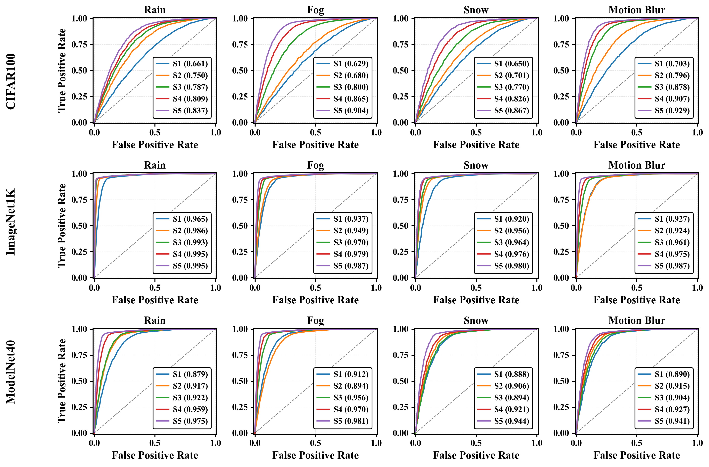
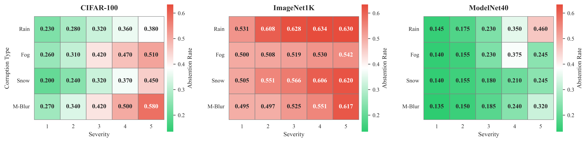

# Uncertainty-Aware, Abstention-Enabled Safe Predictions with Dual-Threshold Conformalization

## Description
Safety-critical perception systems require both reliable uncertainty quantification and principled abstention mechanisms to maintain safety under diverse operational conditions. We present a novel dual-threshold conformalization framework that provides statistically-guaranteed uncertainty estimates while enabling selective prediction in high-risk scenarios. Our approach uniquely combines a conformal threshold ensuring valid prediction sets with an abstention threshold optimized through ROC analysis, providing distribution-free coverage guarantees (≥ 1 − α) while identifying unreliable predictions.

Through comprehensive evaluation on CIFAR-100, ImageNet1K, and ModelNet40 datasets, we demonstrate superior robustness across camera and LiDAR modalities under varying environmental perturbations. The framework achieves exceptional detection performance (AUC: 0.993→0.995) under severe conditions while maintaining high coverage (>90.0%) and enabling adaptive abstention (13.5%→63.4%±0.5) as environmental severity increases. For LiDAR-based perception, our approach demonstrates particularly strong performance, maintaining robust coverage (>84.5%) while appropriately abstaining from unreliable predictions. Notably, the framework shows remarkable stability under heavy perturbations, with detection performance (AUC: 0.995±0.001) significantly outperforming existing methods across all modalities. Our unified approach bridges the gap between theoretical guarantees and practical deployment needs, offering a robust solution for safety-critical autonomous systems operating in challenging real-world conditions.

### Keywords
- Conformal prediction
- Uncertainty quantification
- Abstention mechanisms
- Multi-modal perception
- Out-of-distribution detection
- Environmental perturbations

## Installation
To set up the project, follow these steps:

1. Clone the repository
```bash
git clone https://github.com/divake/Conformal_Prediction_based_Sensor_Trustworthiness_Detection.git
cd src
```

2. Install the required dependencies:
```bash
pip install -r requirements.txt
```

## Usage
The project supports three different datasets with separate implementation files:

1. For ModelNet40 dataset:
```bash
python src/abstention_analysis_nonconformity.py
```

2. For ImageNet dataset:
```bash
python src_imagenet/abstention_analysis_nonconformity.py
```

3. For CIFAR-100 dataset:
```bash
python src_vision/abstention_analysis_nonconformity.py
```

## Results and Analysis

### Performance Analysis

Performance metrics (Coverage, Set Size, Entropy, Confidence, Margin) across different perception tasks and environmental conditions. Heatmaps show framework's adaptation to various perturbations with increasing severity.

### Detection Performance

ROC curves showing detection performance across different tasks and environmental conditions (rain, fog, snow, motion blur), with severity levels S1-S5. AUC scores demonstrate framework's robustness to perturbations.

### Abstention Behavior

Abstention rates visualization across different perception tasks under various environmental perturbations, showing how the framework adapts its decision-making under different conditions. 


## Project Structure
```
.
├── checkpoints/          # Model checkpoints
├── corruption_checks/    # Corruption testing utilities
├── dataset/             # Dataset storage
├── logs/                # Application logs
├── plots/               # General visualization plots
├── plots_imagenet/      # ImageNet-specific plots
├── plots_vision/        # Vision-related plots
├── src/                 # Core source code
├── src_imagenet/        # ImageNet-specific implementations
└── src_vision/          # Vision-specific implementations
```

## Contributing
We welcome contributions to improve the project! Here's how you can help:

1. Fork the repository
2. Create a new branch (`git checkout -b feature-branch`)
3. Make your changes and commit them (`git commit -m 'Add new feature'`)
4. Push to the branch (`git push origin feature-branch`)
5. Open a Pull Request

Please ensure your code follows the existing style and includes appropriate tests.

## License
MIT

## Contact
For questions, suggestions, or collaboration opportunities, please contact:
- Email: dkumar33@uic.edu
